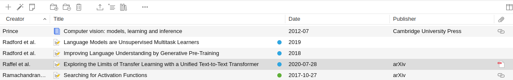
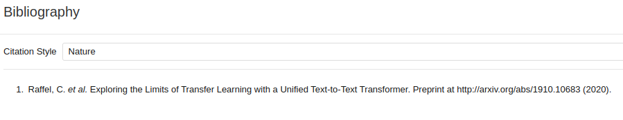
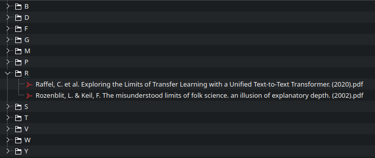

# Literature File Renamer

Over time I've read a bunch of books and papers. For the papers I usually have PDF files that sit on my computer. To organize the literature that I read I have it all in Zotero.



For each paper I can generate a citation, I like the Nature format because I've been using that in Physics. It looks like this:



Now one can copy that into the clipboard. But when pasting it, one will get a bunch of whitespace and this leading `1.`:

```


  
    1.Raffel, C. et al. Exploring the Limits of Transfer Learning with a Unified Text-to-Text Transformer. Preprint at http://arxiv.org/abs/1910.10683 (2020).
  


```

Also the URL doesn't make for a good file name. I want to take this citation as the file name, but I need to remove the number, the URL (slashes are a problem). Also for the Android file system I need to remove the colons and replace them with something else.

This Python package contains a program `literature-file-renamer` which has two sub-commands:

- `rename` renames single files from the Zotero formatted way by trimming whitespace, removing the leading `1.` and the URL as well as to replace any colons with periods.
- `organize` recursively moves all files into subdirectories with the first letter.

See `literature-file-renamer --help` for more usage details.

After running `organize`, my literature directory looks like this:



Depending on the number of papers one might just want to have them all in one flat directory structure or start to need a bit more structure.